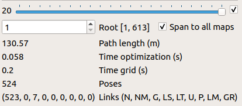
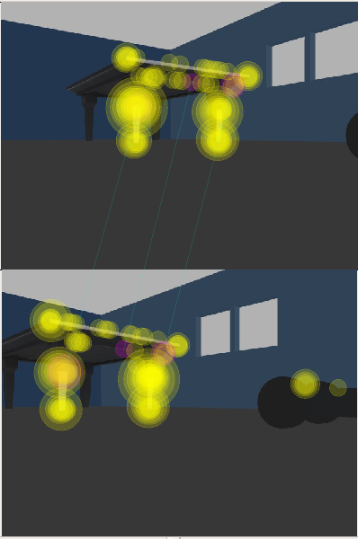
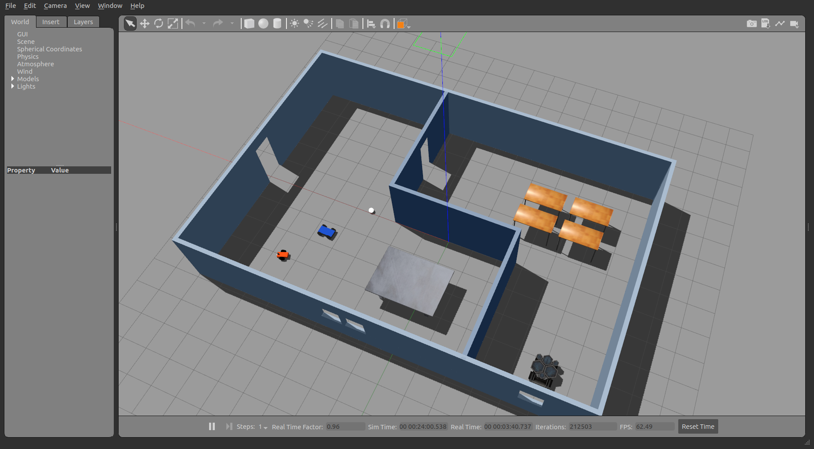
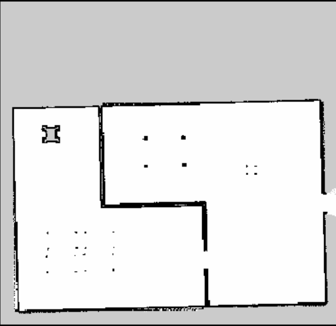
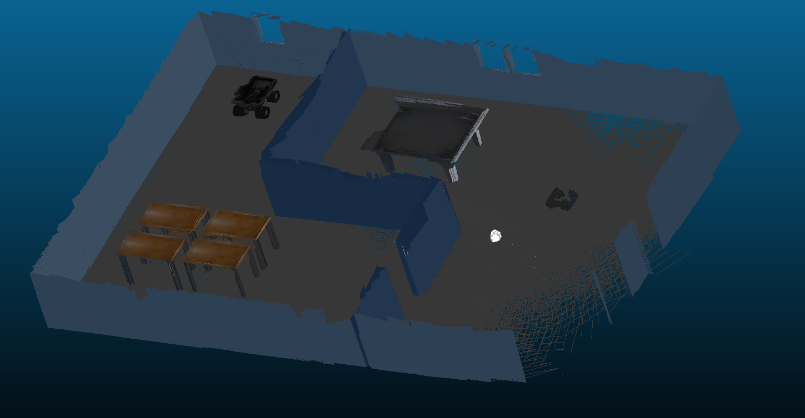

# RSEND-Project4
Map My World! Project - Using a Mobile Robot to map an environment

### Google Drive link for the RTAB Mapping Database: [rtabmap.db](https://drive.google.com/drive/folders/1CM_k3WNitjVhcCMhoIxC4BFIlGzVD_1K?usp=sharing)

### Total Global loop closures obtained: 7

### Robot's World

### 2D Map

### 3D Map

